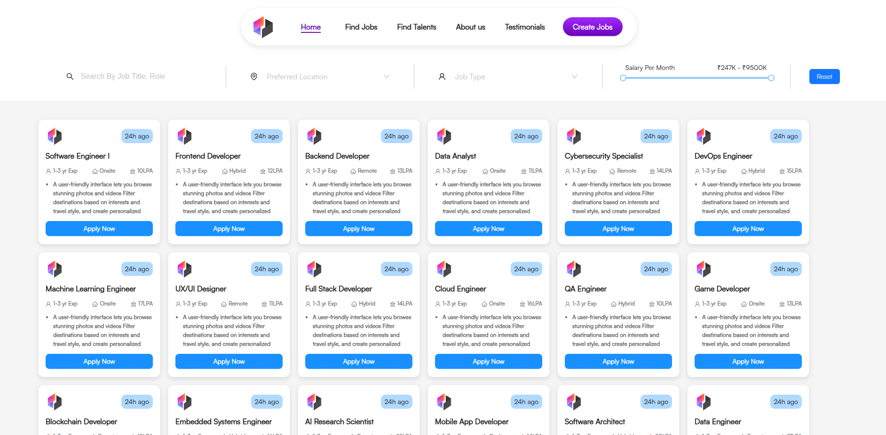

# JobPilot Admin Dashboard 🚀

A sleek, modern job posting platform built with React, TypeScript, and Supabase. Streamline your recruitment process with our intuitive admin dashboard.

## 🔗 [Live Demo](https://rococo-tartufo-745e98.netlify.app)

## ✨ Features

- **Single Page Application**: Lightning-fast performance with no page reloads
- **Job Post Management**: Create and manage job listings effortlessly
- **Advanced Filtering**: Filter jobs by:
  - Location
  - Job Type
  - Salary Range
  - Search Keywords
- **Real-time Updates**: Instant database synchronization with Supabase
- **Responsive Design**: Seamless experience across all devices

## 🛠️ Tech Stack

- **Frontend**: React 18 with TypeScript
- **Styling**: Ant Design + Custom CSS
- **Build Tool**: Vite
- **Backend**: Supabase
- **Deployment**: Netlify

## 🌟 Key Features in Detail

### Job Post Creation
- Title and company information
- Salary range specification
- Job type selection
- Detailed description support
- Location settings

### Advanced Filtering System
- Real-time search functionality
- Location-based filtering
- Salary range slider
- Job type categorization

## 📝 License

This project is licensed under the MIT License - see the [LICENSE](LICENSE) file for details.

## 🙏 Acknowledgments

- [Supabase](https://supabase.io/) for the backend infrastructure
- [Ant Design](https://ant.design/) for the UI components
- [Vite](https://vitejs.dev/) for the blazing fast build tool

---

Made with ❤️ by Nagaraju Kasarla
